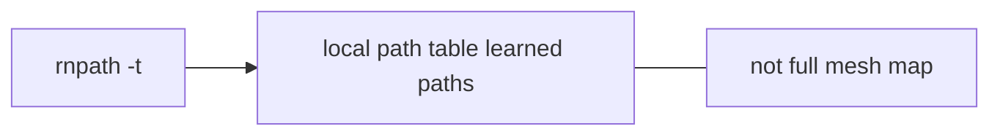

# rnpath

**Version note:** Help text captured from `rnpath` **1.2.5** (see sample file).

## Synopsis

`rnpath` inspects and manages paths to destinations, including optional remote management and blackhole-related operations.

**Diagrams:** [visual index](../concepts/visual-index.md)



**Figure: path table shows destinations your stack knows how to reach**

## Prerequisites

Shared local RNS instance (same considerations as [rnstatus.md](rnstatus.md)).

## Example

Show path table:

```bash
rnpath -t
```

JSON output:

```bash
rnpath -t -j
```

## Sample output

- [`--help`](../../samples/cli/rnpath-help-1.2.5-Darwin.txt)

Add a redacted `rnpath -t -j` capture once you have a live network.

## Troubleshooting

- **Timeouts on remote flags (`-R`, `-W`):** Verify remote management configuration on the target instance and identity paths (`-i`) per the manual.

## See also

- [Routing: paths, announces, and reactive reachability](../concepts/routing-paths-and-announces.md) — what the path table means
- [Mesh CLI worked examples](../guides/mesh-cli-examples.md) (`rnpath -t` and single-destination path)
- [Reticulum manual — Understanding](https://reticulum.network/manual/understanding.html)
- [Reticulum manual — Using](https://reticulum.network/manual/using.html)
- [FOSDEM 2026 slides](https://fosdem.org/2026/events/attachments/9NCWUR-reticulum_community_meetup_implementations_migration_and_future/slides/267005/reticulum_dimz1j8.pdf) (tooling / community daemons)
