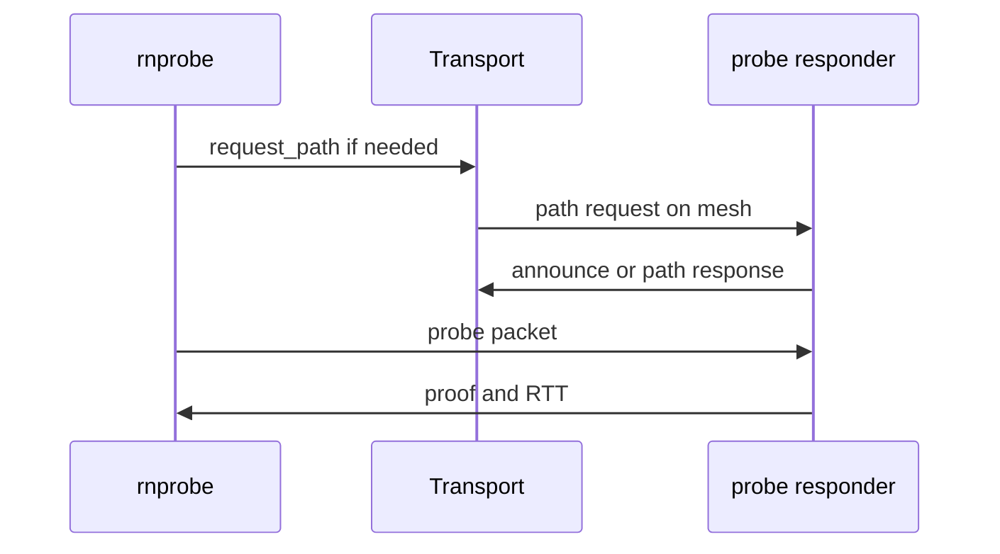

# rnprobe

**Version note:** Help text captured from `rnprobe` **1.2.5** (see sample file).

## Synopsis

`rnprobe` sends probe traffic to a **specific destination** (application name + aspects + hash) to measure reachability and latency. Each application on a node has a **different** destination hash; probing the wrong hash or a hash with **no listener** times out.

**Diagrams:** [visual index](../concepts/visual-index.md)



**Figure: path discovery then probe packet**

## Prerequisites

- Shared RNS instance (`rnsd`) on the initiator with a path to the target hash.
- On the **target**: the **Transport Instance** running with **`enable_transport = Yes`** and **`respond_to_probes = Yes`** in `[reticulum]` (both required; see [new-node-setup.md §5](../guides/new-node-setup.md#5-announces-and-probes-rnprobe)).
- **Both** CLI arguments: full destination name **and** hash (see examples).

## Example

Transport probe (most common connectivity test):

```bash
rnprobe rnstransport.probe <probe_responder_destination_hash>
rnprobe rnstransport.probe 28a479e075763f02c03522a5f95b7a08 -n 10 -t 30
```

Find the probe responder hash on the target with `rnstatus -v` (**Probe responder at … active**).

## Sample output

- [`--help`](../../samples/cli/rnprobe-help-1.2.5-Darwin.txt)

Capture a real probe transcript separately; probes generate traffic—use only on networks you operate or have permission to test.

## Troubleshooting

- **`Path request timed out`:** No route yet—interfaces, announces, or wrong hash.
- **`Probe timed out`:** Path OK but wrong hash/aspect, target not listening, or `respond_to_probes = No`.
- Full checklist and wrong-vs-right commands: [new-node-setup.md § `rnprobe` always times out](../guides/new-node-setup.md#rnprobe-always-times-out).

## See also

- [Routing: paths, announces, and reactive reachability](../concepts/routing-paths-and-announces.md) — path requests before probes
- [Mesh CLI worked examples](../guides/mesh-cli-examples.md) (`rnprobe rnstransport.probe <hash>`, RSSI/SNR sample)
- [Reticulum manual](https://reticulum.network/manual/index.html)
- [n00q — Reticulum Notes](https://n00q.net/blog/reticulum-notes/)
