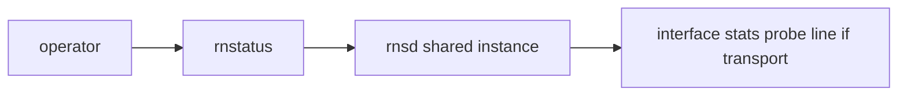

# rnstatus

**Version note:** Help text captured from `rnstatus` **1.2.5** (see sample file).

## Synopsis

`rnstatus` queries the **shared local RNS instance** and prints interface status, traffic, and related statistics.

**Diagrams:** [visual index](../concepts/visual-index.md)



**Figure: rnstatus reads local daemon state, not remote routing tables**

## Prerequisites

A running shared instance (typically from `rnsd` or another program that initialized Reticulum with `share_instance = Yes`). If nothing is running, you will see the error in the sample below.

## Example

```bash
rnstatus
rnstatus -a
rnstatus -v
rnstatus -j | jq .
```

## Sample output

- [`--help`](../../samples/cli/rnstatus-help-1.2.5-Darwin.txt)
- [No shared instance (exit code 1)](../../samples/cli/rnstatus-no-shared-instance-1.2.5-Darwin.txt)

When a daemon is up, capture a fresh transcript (interfaces redacted) as `rnstatus-running-…-Linux.txt`.

## Troubleshooting

| Message | Likely cause |
|---------|----------------|
| `No shared RNS instance available to get status from` | `rnsd` not running, or different `--config` / instance name between tools |

Run `rnstatus` with the same `--config` path as `rnsd` if you use a non-default config directory.

## See also

- [Mesh CLI worked examples](../guides/mesh-cli-examples.md) (finding probe responder hashes with `rnstatus -v` on the peer)
- [rnsd.md](rnsd.md)
- [Reticulum manual — Using Reticulum on your system](https://reticulum.network/manual/using.html)
- [FOSDEM 2026 slides — remote management / tooling](https://fosdem.org/2026/events/attachments/9NCWUR-reticulum_community_meetup_implementations_migration_and_future/slides/267005/reticulum_dimz1j8.pdf)
