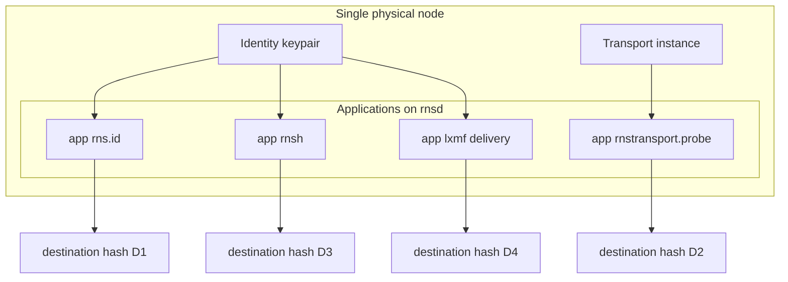
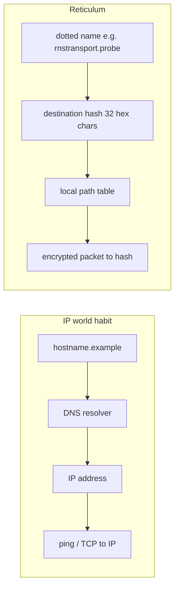
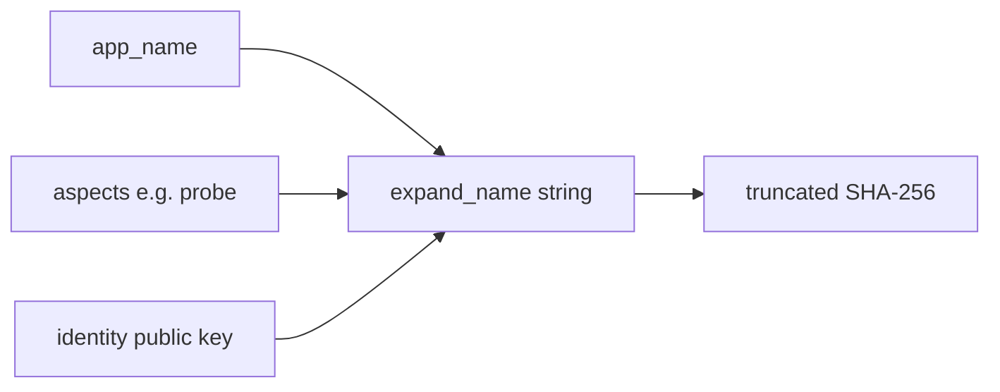
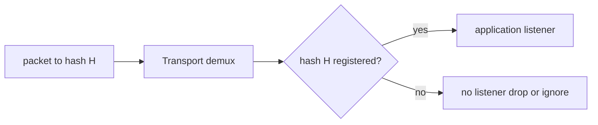

# Destinations, listeners, and announces

**Version note:** Behaviour described here matches the **Python RNS** reference implementation (e.g. 1.2.x). Other implementations should be equivalent at the protocol level, but internals may differ.

**Diagrams:** [visual index](visual-index.md) · [style guide](diagrams-style.md)

## What “address” means

In Reticulum, an **addressable endpoint** is a **destination**: a cryptographic hash derived from `app_name`, one or more **aspects**, and an **identity** (see [Understanding — Destinations](https://reticulum.network/manual/understanding.html)). Peers use that **destination hash** to reach you once they have a **path**.

One physical node (one operator, one `rnsd`) normally has **many** destination hashes—one per application service, plus transport-managed destinations—not a single “node IP”:

**Figure: one node, many destinations** — each box on the right is a distinct hash on the wire; probing `D2` does not reach `D3`.

### Not DNS: dotted names vs hashes

**Figure: DNS resolves names globally; Reticulum routes on hashes** — the dotted name helps your stack build crypto context; it is not looked up like DNS. See [mesh-cli-examples § rnprobe](../guides/mesh-cli-examples.md#probe-a-responder-rnprobe).

### How a dotted name becomes a hash

**Figure: name material → destination hash** — for `SINGLE` destinations the implementation also binds the identity keys so each hash is unique ([manual](https://reticulum.network/manual/understanding.html)).

| Label | Example | Used by |
|-------|---------|---------|
| `app_name` | `rnstransport`, `rnsh`, `lxmf` | Application or transport code |
| aspects | `probe`, `shell`, delivery aspect | Same |
| hash on wire | `a1b2c3d4…` (32 hex digits) | `rnpath`, `rnprobe`, all transports |
| full name (CLI) | `rnstransport.probe` | `rnprobe`, logging |

## When the stack will treat a destination as “yours”

Applications that **receive** traffic create an **incoming** (`IN`) destination and register it with `Transport.register_destination()`. Only then does the local stack keep that hash in `Transport.destinations` / `destinations_map` and deliver matching packets to the app.

**Figure: listening = registered IN destination** — if nothing registered that hash, there is no app to receive the packet.

If **no** application has opened that destination, there is no local listener: the stack does not accept traffic for that hash on behalf of an app (there is nothing to hand the packet to).

So: **reachability on your node** is tied to **something having registered that incoming destination**—colloquially, “listening.”

## When something is “advertised” on the network

**Announce** packets (`Destination.announce()` in Python RNS) broadcast keys and routing hints so others can learn paths and open encrypted sessions.

Important details from the reference implementation:

1. **Only certain destinations can emit a normal announce:** `announce()` requires type `SINGLE` and direction `IN` (see `Destination.announce` in RNS).

2. **When an app registers an incoming `SINGLE` destination** while attached to a shared instance, Transport schedules an initial **`path_response=True`** announce. That helps the mesh learn how to reach you after you start listening—it is not the same as every application’s periodic “here I am” discovery announce.

3. **Broader discovery** (so arbitrary peers find you over time) still depends on the **application** (or you manually running something like `rnid -a …`) calling `destination.announce()` on a cadence, or equivalent logic. If nothing ever announces, remote nodes may never learn a path even if you are listening.

So the accurate mental model is:

- **Listening (registered IN destination)** → required for **local delivery** and triggers **initial path-response style** announce behaviour on register (for `SINGLE` destinations).
- **Ongoing visibility / discovery** → still requires **announce traffic** driven by the app (or tools like `rnid`), not “the address exists” in isolation.

For how announces interact with **on-demand paths**, see [routing-paths-and-announces.md](routing-paths-and-announces.md).

## How to see what is listening (operationally)

There is **no single stock CLI** that prints “all local destinations” as a friendly table in every install. Practical approaches:

| Approach | What it tells you |
|----------|-------------------|
| **Application UI / logs** | Nomad Network, LXMF clients, `rnsh -p`, **`rncp -p`**, etc., usually show their own destination hashes and announce state. |
| **`rnid -i <identityfile> -H <aspect>`** | Destination hashes for that identity and aspect string (see [rnid.md](../cli/rnid.md)). |
| **`rnstatus`** | Interfaces, rates, discovered interfaces—**not** a full list of registered app destinations. |
| **`rnpath -t`** (and JSON variants) | **Known paths** (often remote), not necessarily every local listener. |
| **Verbose daemon logging** | `rnsd -v` / higher log levels can show lifecycle events depending on code paths; use sparingly and redact logs before sharing. |

If you need a definitive list for automation, the supported path is usually **inside the application** (or a small Python snippet using the same RNS API your apps use), not a single undocumented file.

## See also

- [Visual index](visual-index.md)
- [Routing: paths, announces, and reactive reachability](routing-paths-and-announces.md) — why paths are on-demand, how announces differ, LoRa airtime.
- [Mesh CLI worked examples](../guides/mesh-cli-examples.md) — lab table mapped to destination boxes.
- [New node setup](../guides/new-node-setup.md) — announces with `rnid -a`, probes, `rnsh`.
- [Reticulum manual](https://reticulum.network/manual/index.html) — destinations, links, announces.
- In your Python install, read `RNS/Destination.py` (`Destination.announce`: only `SINGLE` + `IN`) and `RNS/Transport.py` (`register_destination`: initial `path_response` announce when registering on a shared instance).
