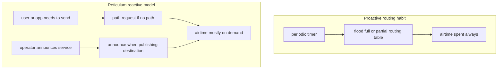
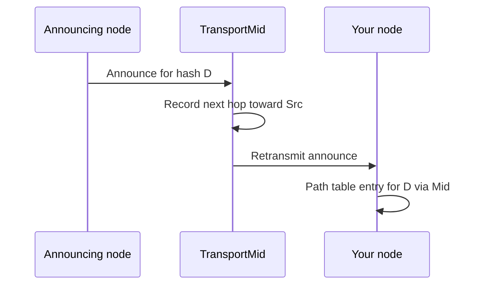
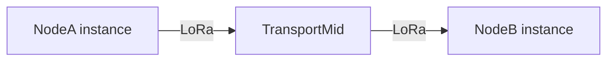
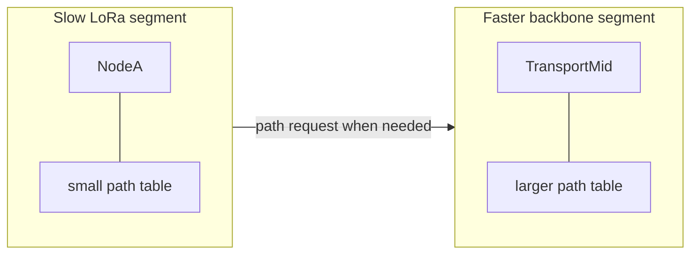

# Routing: paths, announces, and reactive reachability

**Version note:** Behaviour described here matches the **Python RNS** reference implementation (e.g. 1.2.x). Protocol semantics are defined upstream; this page is an operator-oriented summary with links to the canonical manual.

**Primary upstream source:** [Reticulum manual — Understanding Reticulum](https://reticulum.network/manual/understanding.html) (mirror: [markqvist.github.io](https://markqvist.github.io/Reticulum/manual/understanding.html)).

**Diagrams:** [visual index](visual-index.md) · [style guide](diagrams-style.md)

---

## Mental model in one minute

Reticulum is a **reactive** mesh routing system, not a proactive one.

| Mechanism | When it happens | What it teaches the network |
|-----------|-----------------|-----------------------------|
| **Announce** | When an app (or transport) **chooses** to announce a destination—often on a timer | “Here is a destination hash, its public keys, and routing hints.” Transport nodes record **one hop back** toward whoever forwarded the announce. |
| **Path request** | When **your** stack needs to reach a hash it does not know yet | “Who can get me closer to this destination?” Peers that already learned that destination reply with announce-derived information. |

There are **no periodic routing-table broadcasts** of the kind familiar from OSPF, BGP, or Wi‑Fi mesh protocols. That is intentional: on **LoRa** and other slow, shared channels, flooding full tables would waste airtime. Instead, the mesh converges **what it needs, when it needs it**, and announces are **budgeted** (bandwidth caps, hop limits, deduplication).

You still see traffic on the channel—but it is mostly **announces for destinations that exist**, and **path traffic triggered by actual sends**, not “here is my entire routing table every N seconds.”

### Proactive vs reactive (visual)



**Figure: reactive routing saves airtime on LoRa** — no standing routing-table broadcast; paths and announces appear when needed or when a service advertises itself.

---

## How this differs from IP and DNS

| Habit from IP networks | Reticulum |
|------------------------|-----------|
| Every router advertises reachability to prefixes | No global prefix table; each transport node knows only **the next hop** toward a **destination hash** it has learned. |
| `ping hostname` resolves DNS then ICMP to one host address | Many **destinations** per node; you target a **hash** (and build crypto context with app/aspect names). See [destinations-announces-listeners.md](destinations-announces-listeners.md). |
| Routing protocols flood or sync topology | **Paths are pulled on demand**; **announces push presence** of specific destinations. |

No single node holds the full path from you to a distant peer. The manual states that every transport node only knows the most direct way to move a packet **one hop closer** to the destination hash ([Transport section](https://reticulum.network/manual/understanding.html#reticulum-transport)).

---

## Announces: nodes advertise themselves (and apps advertise services)

An **announce** is a signed packet that carries, at minimum:

- The **destination hash** being announced  
- **Public key material** so peers can encrypt to that destination  
- Optional **application-specific data**  

When a transport node receives an announce it has not seen before, it records **which neighbour interface** the announce arrived on. That neighbour becomes the **next hop** for packets addressed to that destination hash. Announces are then **retransmitted** according to rules (deduplication, hop limit, bandwidth caps, retry)—see [The Announce Mechanism in Detail](https://reticulum.network/manual/understanding.html#the-announce-mechanism-in-detail).



**Figure: announce teaches one hop back** — neither Mid nor You learns the full end-to-end path in one table row; each node only stores **next hop** toward *D*.

### LoRa mesh topology (three nodes)



**Figure: multi-hop over transport nodes** — each box only forwards using its local path table (next hop toward the destination hash).



### What announces are *not*

- **Not a full routing table** — only information about **that** destination (and how to reach the announcer’s transport context).  
- **Not automatic for every hash on your machine** — only destinations that **announce** (or are answered via a path request) populate remote path tables. Listening alone is not enough for wide discovery; see [destinations-announces-listeners.md](destinations-announces-listeners.md).  
- **Not DNS** — aspect names like `rns.id` or `rnstransport.probe` are developer labels; the wire address is the **hash**.

### Why operators still run announces

Tools such as `rnid -a` or application logic call `destination.announce()` so neighbours learn your keys and transport nodes can forward toward you. Without announces (and without someone else’s path request succeeding), remote nodes may have **no path** even if you are online.

Announce traffic is **throttled** per interface (default caps on announce bandwidth, queueing by hop distance). Fast backbones can converge quickly; slow LoRa segments prioritise **local** announces and may never hold a full picture of a huge mesh—and that is acceptable by design.

### Slow segments and “partial convergence”

The manual’s important tip: networks that **cannot** process enough announces to learn everyone still work, because **path requests pull** knowledge from better-connected segments when a node actually tries to reach a distant hash ([manual tip after announce rules](https://reticulum.network/manual/understanding.html#the-announce-mechanism-in-detail)):

> Even very slow networks … will generally still be able to reach any other destination on any connected segments, since interconnecting transport nodes will prioritize announces into the slower segments that are **actually requested** by nodes on these.

So LoRa operators should expect a **small path table** (`rnpath -t`) compared to the whole mesh, not a failure—until they try to reach someone new.



**Figure: partial convergence is normal** — the slow segment learns distant destinations when it **asks**, not by mirroring the entire mesh.

---

## Paths: learned on demand when you send

A **path** is local state: “to reach destination hash *D*, forward to next-hop hash *H* on interface *I*.” Paths appear when:

1. **You receive an announce** for *D* (passive learning), or  
2. **You (or your app) issue a path request** because you need to send to *D* and `Transport.has_path(D)` is false (active learning).

### Path request flow (simplified)

When code calls `Transport.request_path(destination_hash)` (as `rnprobe` does before probing), the stack broadcasts a **path request** on `rnstransport` / aspect `path` / `request` (`Transport.request_path` in `RNS/Transport.py`). Rough sequence:

```mermaid
sequenceDiagram
    participant A as Your node (initiator)
    participant T as Transport nodes
    participant B as Peer with path or target

    A->>T: Path request for hash D
    alt B is local destination for D
        B->>A: Announce (path_response) for D
    else B has D in path table
        B->>A: Retransmit cached announce toward D
    else B will discover upstream
        T->>T: Forward / discover path request
        Note over T: May wait for announce elsewhere
    end
    A->>A: Store next hop; has_path(D) true
    A->>B: Application packet (e.g. probe)
```

Details in the reference implementation:

- `Transport.request_path()` — builds and sends the request; records pending state.  
- `Transport.path_request_handler()` — receives requests; may forward discovery or answer if the destination is local.  
- `Transport.path_request()` — if the destination is **local**, calls `announce(path_response=True)`; if known in `path_table`, sends cached announce back toward the requester.  
- When a matching announce arrives while a discovery path request is waiting, transport **answers immediately** with a `PATH_RESPONSE` context announce (see `Transport.py` around the “Got matching announce, answering waiting discovery path request” log path).

Path requests are **not** retried as aggressively as application traffic; there is a minimum interval (`PATH_REQUEST_MI`, 20 seconds by default) for automated rediscovery. Client tools use shorter per-command timeouts (e.g. `rnprobe` default 12 seconds plus hop timeout).

### Reactive routing = traffic only when needed

| Proactive (typical legacy mesh) | Reactive (Reticulum) |
|--------------------------------|----------------------|
| Periodic “here are all my routes” | **No** global routing-table flood |
| Bandwidth spent whether or not anyone talks | Path request + announce **when** a send/link needs a route |
| Centralised or segment-wide convergence required | **Recursive resolution** from segments that know more |

This is why a quiet LoRa channel can stay quiet until someone runs `rnprobe`, opens a link, or an app sends a packet: the stack **asks** for a path instead of **pushing** full topology.

### Sending without a path yet

For **single** destinations, once you have the destination’s **public key** (from an earlier announce or out-of-band exchange), encryption can be prepared **locally** before the first packet leaves—you do not need a round trip just for keys ([Reaching the Destination](https://reticulum.network/manual/understanding.html#reaching-the-destination)). You still need a **path** for multi-hop delivery, which is why tools block on `request_path` until timeout or success.

---

## Transport nodes vs ordinary instances

| Config | Role |
|--------|------|
| `enable_transport = No` (default) | **Instance** — uses the mesh; does not forward others’ traffic. |
| `enable_transport = Yes` | **Transport node** — participates in announce retransmission and path discovery for others. |

Probe responders and wide connectivity for others require transport on the **target** you probe; see [new-node-setup.md §5](../guides/new-node-setup.md#5-announces-and-probes-rnprobe).

---

## What you see on the CLI

| Command | What it reflects |
|---------|------------------|
| `rnpath -t` | **Local path table** — destinations your stack knows how to reach (learned via announces and/or path requests). Entries expire; not “every node in the mesh.” |
| `rnpath <hash>` | Whether a **specific** hash is reachable and over which interface / hop count. |
| `rnprobe …` | Forces `request_path` if needed, then sends probe packets—good end-to-end test of path + listener. |
| `rnid -a …` | Application-driven **announce** (keys + discovery). |
| `rnstatus -v` | Interfaces and rates; not a full routing dump. |

Worked LoRa examples: [mesh-cli-examples.md](../guides/mesh-cli-examples.md).

### Common timeout messages

| Message | Likely meaning |
|---------|----------------|
| `Path request timed out` | No path learned in time—no announce heard, wrong hash, transport down, or mesh partition. |
| `Probe timed out` | Path may exist, but no reply from the **specific** destination/listener (wrong hash/aspect, probe disabled, etc.). |

---

## Links vs single packets (routing angle)

- **Packets** to a destination hash use the path table hop-by-hop; each packet can use ephemeral keys.  
- **Links** add a short setup (request + proof) so bidirectional traffic can use a **link id** on forwarding nodes—still multi-hop, but optimised for sessions. Link setup also **teaches** forwarding state along the path ([Link Establishment](https://reticulum.network/manual/understanding.html#link-establishment-in-detail)).

Both depend on the same underlying announce/path machinery.

---

## Operator checklist

1. **Want to be found?** Ensure your app announces (or use `rnid -a` where appropriate) and that transport nodes can hear you.  
2. **Want to reach someone?** You need their **destination hash** (and correct app/aspect for the tool). First send may trigger a **path request**—allow time on LoRa (`rnprobe -t 60`, etc.).  
3. **Interpret `rnpath -t` sparingly** — a short table on LoRa is normal; it lists **known** paths, not the whole network.  
4. **Do not expect DNS or IP ping semantics** — see [mesh-cli-examples.md § Probe](../guides/mesh-cli-examples.md#probe-a-responder-rnprobe) for `rnstransport.probe` naming.

---

## Further reading

| Resource | Topic |
|----------|--------|
| [Visual index](visual-index.md) | All diagrams in this repo |
| [Understanding Reticulum](https://reticulum.network/manual/understanding.html) | Destinations, transport, announces, links, resources |
| [destinations-announces-listeners.md](destinations-announces-listeners.md) | Listening vs announcing on your node |
| [new-node-setup.md](../guides/new-node-setup.md) | First announces, probes, transport config |
| [rnpath.md](../cli/rnpath.md) | CLI for path table |
| [rnprobe.md](../cli/rnprobe.md) | CLI probes and timeouts |
| `RNS/Transport.py` | `request_path`, `path_request_handler`, announce forwarding |
| [FOSDEM 2026 community deck](https://fosdem.org/2026/events/attachments/9NCWUR-reticulum_community_meetup_implementations_migration_and_future/slides/267005/reticulum_dimz1j8.pdf) | Ecosystem and implementation landscape |
