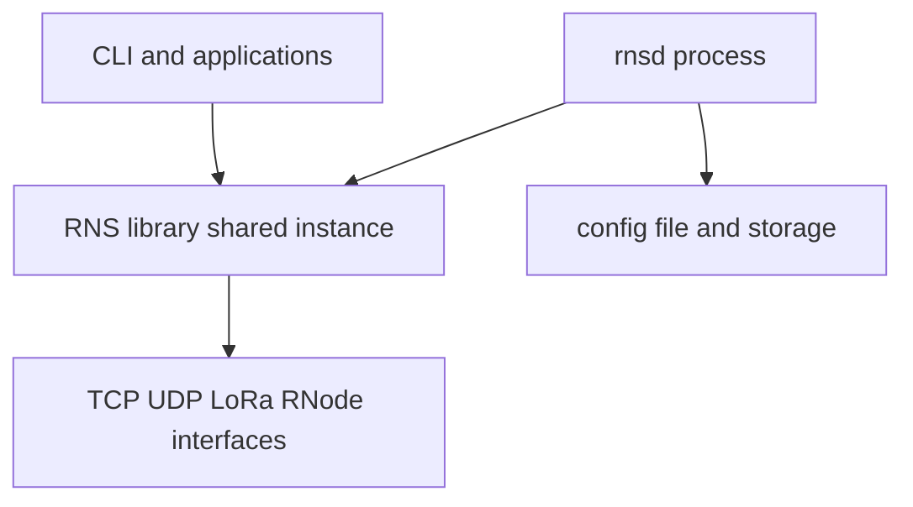

# Config paths and example configuration

**Version note:** Directory behavior is described in the upstream manual; example snippet head from `rnsd --exampleconfig` **1.2.5**.

**Diagrams:** [visual index](../concepts/visual-index.md)



**Figure: one config directory, one daemon, many clients**

## Search order

Reticulum looks for its configuration directory in this order (first match wins):

1. `/etc/reticulum`
2. `~/.config/reticulum`
3. `~/.reticulum`

Override with `rnsd --config /path/to/dir` (and the same `--config` on `rnstatus`, `rnpath`, etc., when not using defaults).

## Generate an example config

The canonical way to see **all** supported directives and comments:

```bash
# rnsd must be on PATH, or use the full path to your venv, e.g.:
# ~/.venvs/reticulum/bin/rnsd --exampleconfig > ~/.reticulum/config.new
rnsd --exampleconfig > /tmp/reticulum.example.conf
less /tmp/reticulum.example.conf
```

If you see `command not found`, add the venv `bin` directory to `PATH` first—see [new-node-setup.md §1](../guides/new-node-setup.md#1-install-the-stack).

Do **not** blindly overwrite your live `config` file; merge sections you need.

**Sample in this repo:** first part of the `[reticulum]` section only: [samples/config/rnsd-exampleconfig-head-1.2.5.txt](../../samples/config/rnsd-exampleconfig-head-1.2.5.txt).

## Files you typically see

| Path | Role |
|------|------|
| `.../config` | Main configuration file |
| `.../storage/` | Identities, caches, runtime data (exact layout per version) |

## See also

- [Visual index](../concepts/visual-index.md)
- [New node setup](../guides/new-node-setup.md)
- [interfaces.md](interfaces.md)
- [config-format-portability.md](config-format-portability.md)
- [Reticulum manual — Using Reticulum on your system](https://reticulum.network/manual/using.html)
- [FOSDEM 2026 — “The Config Problem” / TOML](https://fosdem.org/2026/events/attachments/9NCWUR-reticulum_community_meetup_implementations_migration_and_future/slides/267005/reticulum_dimz1j8.pdf)
