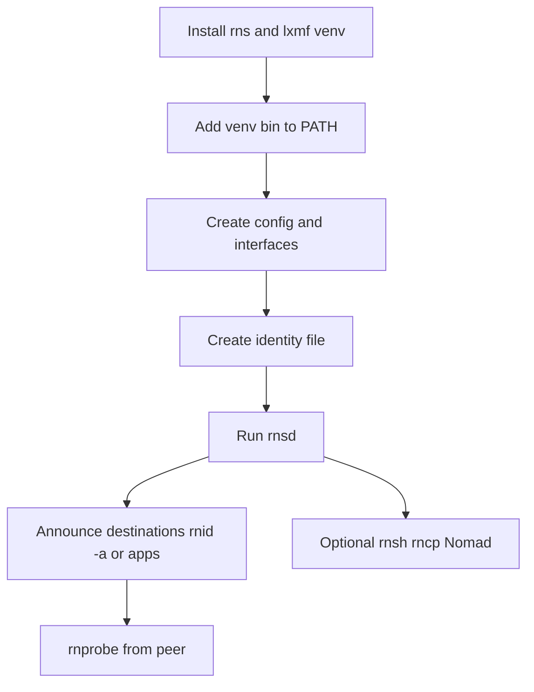
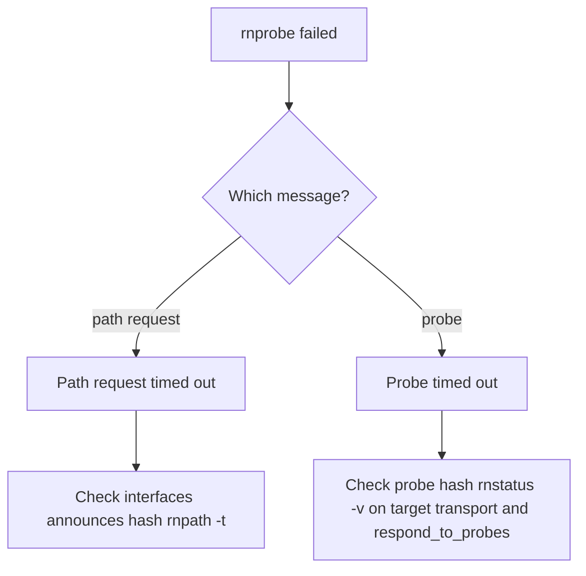

# New node: initial configuration and services

**Version note:** Written for **RNS 1.2.x** (`pip install rns`). Other distributions (RetiNet, `rnsd-rs`) may differ; document what you actually run in the [README](../../README.md) tested-stack table.

This page is an **operator checklist**: install Reticulum, create storage and **identity**, enable **interfaces**, run **`rnsd`**, then layer **rnprobe**, **`rnsh` / `rnx` / `rncp`**, and **Nomad Network** where you need them.

**Diagrams:** [visual index](../concepts/visual-index.md)



**Figure: new node setup flow** — probes and apps assume `rnsd` is running and interfaces match your peers.

## 1. Install the stack

```bash
python3 -m venv ~/.venvs/reticulum
~/.venvs/reticulum/bin/pip install rns lxmf
```

Install **`lxmf` in the same venv as `rns`**. Recent RNS versions require it when **on-network interface discovery** is enabled in config (`discover_interfaces = Yes`). If you skip `lxmf`, `rnsd` can exit with:

```text
[Critical] Using on-network interface discovery requires the LXMF module to be installed.
```

### Install LXMF explicitly (same venv as `rns`)

If you already ran `pip install rns` without `lxmf`, add it with the **venv’s** `pip` (not system `pip`):

```bash
~/.venvs/reticulum/bin/pip install lxmf
```

From your home directory you can also use the relative path:

```bash
.venvs/reticulum/bin/pip install lxmf
```

On a **Raspberry Pi**, `pip` may use [piwheels](https://www.piwheels.org/) as an extra index; that is normal. Example successful install: [pip-install-lxmf-rpi-example.txt](../../samples/cli/pip-install-lxmf-rpi-example.txt).

Verify:

```bash
~/.venvs/reticulum/bin/pip show lxmf rns
```

Then retry `rnsd -v`.

The `rns` package installs CLI tools (`rnsd`, `rnid`, `rnstatus`, …) under the venv’s `bin/` directory. They are **not** on your shell `PATH` until you add that directory (or use the full path every time).

### Add Reticulum CLI tools to your PATH

Pick one approach.

**A. Per-shell session (quick test)**

```bash
export PATH="$HOME/.venvs/reticulum/bin:$PATH"
which rnsd
rnsd --version
```

**B. Every login (recommended on Linux / Raspberry Pi)**

Append to `~/.bashrc` (or `~/.profile` if you use a login shell without bashrc):

```bash
export PATH="$HOME/.venvs/reticulum/bin:$PATH"
```

Then reload:

```bash
source ~/.bashrc
```

On **zsh**, use `~/.zshrc` instead.

**C. No PATH change**

Call tools with the full path, for example `~/.venvs/reticulum/bin/rnsd`. The steps below use a variable so you can copy either way:

```bash
export RNS_BIN="$HOME/.venvs/reticulum/bin"
```

If `which rnsd` prints nothing after (A) or (B), you are not on PATH yet—use (C) or fix the line in your shell config.

## 2. Choose the config directory

Reticulum searches `/etc/reticulum`, then `~/.config/reticulum`, then `~/.reticulum`. Easiest for a single user:

```bash
mkdir -p ~/.reticulum
```

See [paths-and-example.md](../config/paths-and-example.md).

### Generate an example config

**Requires `rnsd` on PATH or via full path** (see §1). If you see `command not found: rnsd`, run the `export PATH=…` or `export RNS_BIN=…` block first.

With PATH set:

```bash
rnsd --exampleconfig > ~/.reticulum/config.new
```

Without PATH (always works after pip install in that venv):

```bash
"${RNS_BIN:-$HOME/.venvs/reticulum/bin}/rnsd" --exampleconfig > ~/.reticulum/config.new
```

Check the file was created and is non-empty:

```bash
wc -l ~/.reticulum/config.new
head -20 ~/.reticulum/config.new
```

Merge what you need into `~/.reticulum/config` (create `config` on first install if it does not exist yet):

```bash
diff -u ~/.reticulum/config ~/.reticulum/config.new 2>/dev/null || true
# Edit ~/.reticulum/config, then remove config.new when done.
```

For a first LAN lab, enable a **TCP server** on one machine and a **TCP client** on another, pointing at the server’s IP and port (see [interfaces.md](../config/interfaces.md) and [samples/config/](../../samples/config/)).

### Interface discovery and LXMF

In `~/.reticulum/config`, under `[reticulum]`, check **`discover_interfaces`**:

| Setting | You need |
|---------|----------|
| `discover_interfaces = Yes` (or enabled) | `pip install lxmf` in the **same** venv as `rns` (see §1) |
| `discover_interfaces = No` | LXMF not required for `rnsd` to start |

The stock `rnsd --exampleconfig` comments show `# discover_interfaces = No` by default; if you enabled discovery from another template or peer config, either install **lxmf** (commands above) or set **`discover_interfaces = No`** and restart `rnsd`.

## 3. Create an identity

Pick a directory for key material (back this up securely if it becomes production):

```bash
mkdir -p ~/.reticulum/storage/identities
rnid --generate ~/.reticulum/storage/identities/node.identity -v
rnid -i ~/.reticulum/storage/identities/node.identity -p
rnid -i ~/.reticulum/storage/identities/node.identity -H rns.id
```

Sample transcript shape: [rnid-print-identity-example-1.2.5.txt](../../samples/cli/rnid-print-identity-example-1.2.5.txt).

**Aspects:** Applications use different **aspect** strings when deriving destination hashes. Default announce for `rnid -a` without arguments uses `rns.id`. Always use `rnid -H <aspect>` to print the hash your peer must use for that app.

## 4. Start the daemon (`rnsd`)

**Before first start:**

1. **`rnsd` on PATH** (§1).
2. **`lxmf` installed** if `discover_interfaces = Yes` (§2).
3. **Config sane for your hardware:** an enabled **RNode** block with a wrong `port` produces `[Error] Could not detect device for RNodeInterface[…]`—install firmware and set `port` first ([rnode-lora-install.md](../linux/rnode-lora-install.md)), or set `enabled = no` until the radio is ready.

Foreground (good for first bring-up):

```bash
rnsd -v
```

You should see interfaces come up and the process **stay running** (no immediate exit after the LXMF critical line). Leave it running. In another terminal (same `PATH`):

```bash
rnstatus
```

If you see `No shared RNS instance available`, `rnsd` is not running or a different `--config` was used. See [rnstatus.md](../cli/rnstatus.md).

## 5. Announces and probes (`rnprobe`)

For how **paths are learned on demand** (path requests) versus **announces** (periodic presence), read [routing-paths-and-announces.md](../concepts/routing-paths-and-announces.md) before debugging timeouts.

`rnprobe` checks **reachability to one specific destination** on a remote node. It is **not** a generic “ping the identity” tool. This section is a **step-by-step** path for new operators.

### What you are testing

The built-in **probe responder** belongs to the **Transport Instance** (`rnstransport`, aspect `probe`). It is **not** your node identity hash and **not** your `rnsh` or `rncp` address. Each application uses a **different destination hash** by design ([destinations-announces-listeners.md](../concepts/destinations-announces-listeners.md)).

### Step 1 — On the node that should answer probes: edit `~/.reticulum/config`

Open the `[reticulum]` section. For a node that should **reply to `rnprobe`**, you need **both** settings:

```ini
[reticulum]
enable_transport = Yes
respond_to_probes = Yes
```

| Setting | Why it matters |
|---------|----------------|
| `enable_transport = Yes` | Starts the **Transport Instance** (routing/announces for others). **Without this, no transport instance runs.** |
| `respond_to_probes = Yes` | Registers the **probe responder** on that transport instance (`rnstransport.probe`). **Without transport running, this does nothing visible.** |

**Common mistake:** `respond_to_probes = Yes` alone while `enable_transport = No` (or left at default `No`). `rnsd` may run, but **`rnstatus` will not show a probe responder**, and remote `rnprobe` will time out.

A **client-only** node (no routing for others) can keep `enable_transport = No` and skip probe responder setup; you would probe **other** nodes that have transport enabled, not yourself.

Merge carefully into your existing `[reticulum]` block; do not duplicate keys. Copy-friendly snippet: [reticulum-transport-probe-responder.txt](../../samples/config/reticulum-transport-probe-responder.txt).

### Step 2 — Restart `rnsd` on that node

Stop any running `rnsd` (Ctrl+C or `systemctl --user stop rnsd.service`), then:

```bash
rnsd -v
```

Watch the log on startup. When transport and probes are enabled correctly, you should see lines **like**:

```text
[Notice]   Transport Instance will respond to probe requests on <rnstransport.probe…>
[Notice]   Transport instance <e6a6b51b79b9fdcd26e912870f2d8eea> started
```

The probe responder **only activates when the transport instance is running**. If you see interfaces come up but **no** “Transport instance … started”, check `enable_transport = Yes` and restart again.

### Step 3 — Confirm probe responder on the target (`rnstatus`)

In a **second terminal** on the **same** machine (with `rnsd` still running):

```bash
rnstatus -v
```

Look for:

```text
Probe responder at <destination_hash> active
```

Copy that **destination hash**—this is what peers use with `rnprobe`, not the identity hash from `rnid -p`.

If this line is **missing**, do not proceed to probing from another host yet. Fix Step 1–2 first (`enable_transport` **and** `respond_to_probes`, then restart `rnsd`).

### Step 4 — From another node: run `rnprobe` (initiator)

On a **different** machine (or same machine only for a local test), with **`rnsd` running** and a path over your interfaces:

```bash
rnprobe rnstransport.probe <destination_hash_from_step_3>
```

`rnprobe` requires **two** arguments: the **full name** `rnstransport.probe` and the **hash**. Example:

```bash
rnprobe rnstransport.probe 28a479e075763f02c03522a5f95b7a08 -n 5 -t 30
```

Success looks like:

```text
Valid reply from <28a479e075763f02c03522a5f95b7a08>
Round-trip time is … over N hop(s) …
```

Worked LoRa example: [mesh-cli-examples.md](mesh-cli-examples.md).

### Step 5 — Optional: other hashes (`rnid -H`)

Identity hash vs service hashes (never interchangeable):

```bash
rnid -i ~/.reticulum/storage/identities/node.identity -p          # identity only
rnid -i ~/.reticulum/storage/identities/node.identity -H rns.id   # another aspect
rnid -i ~/.reticulum/storage/identities/node.identity -H rnstransport.probe
```

If `rnid -H rnstransport.probe` disagrees with **Probe responder at …** from `rnstatus -v`, trust **`rnstatus` on the node where `rnsd` is listening**.

**Troubleshooting (timeouts, wrong hash, no probe line in `rnstatus`):** [§ `rnprobe` always times out](#rnprobe-always-times-out) below.

## 6. Remote shell (`rnsh`)

`rnsh` uses its own identity layout under `~/.rnsh` / `~/.config/rnsh` (see `rnsh --help`). Typical pattern:

**Listener (server):**

```bash
rnsh -l -- /bin/bash --login
# Or restrict callers:
rnsh -l -a <caller_identity_hash> -- /bin/bash --login
```

**Client:**

```bash
rnsh <destination_hash> -- ls -la
```

Print listener destination info (after configuring identity):

```bash
rnsh -p
```

Requires `rnsd` (or another shared instance) with working interfaces. See [rnsh.md](../cli/rnsh.md).

## 7. Remote execution (`rnx`)

Non-interactive “run this command” style. Listener must allow initiator hashes.

```bash
rnx -l -i ~/.reticulum/storage/identities/node.identity -a <initiator_hash>
```

See [rnx.md](../cli/rnx.md).

## 8. File receive (`rncp`)

`rncp` sends or receives files over Reticulum. On a **receiver**, run listen mode with an identity (path is often under `~/.reticulum/storage/identities/`).

**Lab-only (no authentication):**

```bash
rncp -l -v -i ~/.reticulum/storage/identities/default --no-auth
```

**Production-style:** omit `--no-auth` and use `-a <allowed_identity_hash>` or `~/.rncp/allowed_identities` (see `rncp --help`).

Example log (verbose listener on a Raspberry Pi, one completed transfer): [rncp-listen-verbose-raspberrypi4-example.txt](../../samples/cli/rncp-listen-verbose-raspberrypi4-example.txt).

See [rncp.md](../cli/rncp.md).

## 9. Nomad Network

**Nomad Network** is not bundled inside the `rns` wheel on all installs; it is usually a **separate** install:

```bash
pip install nomadnet
```

Then run `nomadnet` (TUI) per upstream docs. It uses Reticulum underneath; configure interfaces in the same Reticulum config `rnsd` uses, start `rnsd`, then start Nomad Network.

Pointers: [Nomad Network on GitHub](https://github.com/markqvist/NomadNetwork) and the [wiki](https://github.com/markqvist/Reticulum/wiki/).

## 10. Run `rnsd` under systemd (Linux)

**Template only** — validate paths and user on your distro.

`~/.config/systemd/user/rnsd.service`:

```ini
[Unit]
Description=Reticulum Network Stack (rnsd)
After=network-online.target
Wants=network-online.target

[Service]
Type=simple
ExecStart=%h/.venvs/reticulum/bin/rnsd -q --service
Restart=on-failure
RestartSec=5

[Install]
WantedBy=default.target
```

Then:

```bash
systemctl --user daemon-reload
systemctl --user enable --now rnsd.service
systemctl --user status rnsd.service
journalctl --user -u rnsd.service -f
```

Use `--config` in `ExecStart=` if your config root is not the default. Transport nodes with LoRa must start **after** USB devices appear; consider a `udev`-triggered path or `After=dev-ttyACM0.device` once you know your stable symlink.

## Troubleshooting

### `command not found: rnsd` (or `rnid`, `rnstatus`, …)

- Install: `~/.venvs/reticulum/bin/pip install rns lxmf` (or your venv path; `lxmf` if discovery is enabled).
- Confirm the binary exists: `ls ~/.venvs/reticulum/bin/rnsd`.
- Add `~/.venvs/reticulum/bin` to `PATH` (§1) and `source ~/.bashrc`, **or** use `~/.venvs/reticulum/bin/rnsd` explicitly.
- System-wide `pip install --user rns` puts scripts in `~/.local/bin`; add that directory to `PATH` instead if you installed that way.

### `rnsd --exampleconfig` produces an empty file or errors

- Usually the shell ran `rnsd` from PATH but the wrong binary, or `rnsd` was missing and the redirect still created an empty `config.new`. Delete `config.new` and rerun with the full venv path from §2.
- Verify: `"$HOME/.venvs/reticulum/bin/rnsd" --version`.

### `rnsd` exits: LXMF required for interface discovery

```text
[Critical] Using on-network interface discovery requires the LXMF module to be installed.
```

**Fix A (recommended if you use discovery):** in the same venv as `rns`:

```bash
~/.venvs/reticulum/bin/pip install lxmf
```

Expected output shape (versions may differ): [pip-install-lxmf-rpi-example.txt](../../samples/cli/pip-install-lxmf-rpi-example.txt). On Raspberry Pi you should see `Successfully installed lxmf-…` and `rns>=1.2.5` already satisfied.

**Fix B (minimal node, no discovery):** in `~/.reticulum/config` under `[reticulum]` set `discover_interfaces = No`, save, restart `rnsd`.

### `Could not detect device for RNodeInterface`

- RNode section is **enabled** but `port` does not match a connected device, firmware is missing, or the radio is unplugged.
- Follow [rnode-lora-install.md](../linux/rnode-lora-install.md) (`rnodeconf -a` / `-i`, then config `port` and RF parameters).
- Set `enabled = no` on that interface until hardware is ready, or fix `port` (see [rnode-usb.md](../linux/rnode-usb.md)).
- This error alone does not always stop `rnsd`; the **LXMF** critical line does if discovery is on and `lxmf` is missing.

### `rnstatus` / `rnpath`: no shared instance

- Start `rnsd` (or another app that starts the shared stack).
- Pass the same `--config /path/to/reticulum` to **every** CLI if you do not use the default search path.

### Serial / RNode: permission denied

- See [rnode-usb.md](../linux/rnode-usb.md).

### TCP peer never connects

- **Firewall:** open the `TCPServerInterface` `listen_port` (default often 4242 in examples) on the server host.
- **Address:** client `target_host` / `target_port` must match where the server listens (`0.0.0.0` vs specific IP).
- **Both sides:** at least one interface enabled (`enabled = yes` in your config version’s spelling).

### `rnprobe` always times out

`rnprobe` can fail in two different stages. Read the message carefully:



**Figure: rnprobe troubleshooting decision tree**

| Message | Meaning |
|---------|---------|
| `Path request timed out` | The mesh has **no route** to that destination hash yet (interfaces, announces, wrong hash). |
| `Sent probe …` then `Probe timed out` | A path existed, but **nothing answered** at that hash (wrong app/aspect, listener not running, or probes disabled on target). |

See also [destinations-announces-listeners.md](../concepts/destinations-announces-listeners.md): probing an address with **no registered listener** will time out even if the identity is “online.”

#### No “Probe responder” line in `rnstatus -v`

The probe responder is **part of the Transport Instance**, not a separate daemon.

1. In `~/.reticulum/config` under `[reticulum]`, set **both**:
   - `enable_transport = Yes`
   - `respond_to_probes = Yes`
2. Restart `rnsd` and confirm log lines:
   - `Transport instance <…> started`
   - `Transport Instance will respond to probe requests on <rnstransport.probe…>`
3. Run `rnstatus -v` again.

If `enable_transport = No`, transport never starts → **no probe responder** → remote `rnprobe` always times out even when `respond_to_probes = Yes`.

#### One identity, many destination hashes (by design)

Reticulum derives a **different destination hash** for each combination of **identity + app name + aspects**. The identity hash from `rnid -p` is **not** the hash you use for `rnsh`, **LXMF**, **Nomad Network**, or the transport **probe responder**.

Example cheat sheet (same lab, illustrative):

| Peer | Role | Hash (hex) |
|------|------|------------|
| Chris | identity (`rnid -p`) | `9839c928768eca38683eb556e72e854e` |
| Chris | **probe responder** (`rnstransport.probe`) | `28a479e075763f02c03522a5f95b7a08` |
| Chris | **rnsh** listener | `5e2b1e3934cc6af561124087ef6faaca` |
| Emmanuel | **rnsh** listener | `9363366a60acd789745f58a7563621cb` |

Probing Chris’ **identity** hash or **rnsh** hash with `rnstransport.probe` will **time out**. You must use the **probe responder** hash with the **probe** aspect name.

Discover the probe hash on the **target** node:

```bash
# On the peer being probed (rnsd running; enable_transport = Yes; respond_to_probes = Yes)
rnstatus -v
# Look for: Probe responder at <hash> active
```

Or, on the peer, derive the hash for the same dotted name you pass to `rnprobe` (must match transport’s `rnstransport` + `probe` aspect):

```bash
rnid -i ~/.reticulum/storage/identities/default -H rnstransport.probe
```

If that disagrees with `rnstatus -v`, trust **Probe responder at …** on the node that is actually listening.

Use `rnid -H …` separately for each service (`rns.id`, Nomad, LXMF, `rnsh`, etc.); aspect strings are **not** interchangeable.

#### Correct `rnprobe` syntax (name + hash)

`rnprobe` needs **both** arguments (see [Reticulum manual — Using Reticulum](https://reticulum.network/manual/using.html) and `rnprobe --help`):

```bash
rnprobe <full_destination_name> <destination_hash>
```

**Works** (target has `rnsd` with `enable_transport = Yes`, `respond_to_probes = Yes`, path exists):

```bash
rnprobe rnstransport.probe 28a479e075763f02c03522a5f95b7a08
rnprobe rnstransport.probe 28a479e075763f02c03522a5f95b7a08 -n 10 -t 30
```

**Will time out or fail** (wrong address / no listener):

```bash
# Hash only — missing full name; rnprobe will error or refuse
rnprobe 28a479e075763f02c03522a5f95b7a08

# Right hash, wrong aspect name (packets go to wrong destination namespace)
rnprobe rnstransport.probe 5e2b1e3934cc6af561124087ef6faaca   # rnsh hash, not probe

# Probe name but identity hash
rnprobe rnstransport.probe 9839c928768eca38683eb556e72e854e

# Target has transport/probes disabled
# (enable_transport = No and/or respond_to_probes = No — no probe responder in rnstatus)
```

**Application listeners** (e.g. `rnsh`, `rncp`) only respond on **their** destination hashes. To test `rnsh`, the peer must run `rnsh -l …` and you must probe whatever destination/hash `rnsh` advertises—not `rnstransport.probe` unless that is what you intend.

#### Checklist before blaming the radio

1. **Target:** `rnsd` running; for transport probes, **`enable_transport = Yes` and `respond_to_probes = Yes`**, log shows transport instance started + probe notice, `rnstatus -v` shows **Probe responder at … active**.
2. **Initiator:** `rnsd` running; same config root if you use `--config`.
3. **Path:** `rnpath -t` shows the destination (or wait after announces); try `rnpath <probe_hash>` on the initiator.
4. **Hash:** from **Probe responder** line or `rnid -H` with the **same** aspect as the `rnprobe` name (`rnstransport.probe`).
5. **Command:** two arguments: `rnprobe rnstransport.probe <hash>`.
6. **Latency:** on LoRa, increase timeout: `rnprobe rnstransport.probe <hash> -t 60` (see [rnprobe.md](../cli/rnprobe.md)).

Worked example with RSSI/SNR: [mesh-cli-examples.md](mesh-cli-examples.md).

### `rnsh` / `rnx` authentication failures

- Listener `-a` must include the initiator’s **identity** hash (not always the same string as a destination hash — use `rnid -p` / `rnsh -p` as appropriate).
- Check `~/.rnsh/allowed_identities` paths documented in `rnsh --help`.

### `rncp` never shows “listening” or transfers stall

- Confirm `rnsd` and identity path; try `rncp -p -i …` on the listener.
- Sender must target the **listener destination hash** printed when listen starts (see sample transcript).
- Prefer authenticated mode instead of `--no-auth` once paths work.

### Nomad Network cannot reach the stack

- Confirm `rnsd` is running first, then launch Nomad Network.
- Align `--config` / `RNS` config directory with what Nomad Network expects (per its docs).

### Wrong config picked up

- Remember search order: `/etc/reticulum` wins over `~/.reticulum`. See [paths-and-example.md](../config/paths-and-example.md).

### RF / LoRa interfaces do not start

- Parameters must match hardware and **local law**; see [interfaces.md](../config/interfaces.md).

## See also

- [Visual index](../concepts/visual-index.md)
- [README — quick path](../../README.md)
- [Routing: paths, announces, and reactive reachability](../concepts/routing-paths-and-announces.md)
- [Destinations, listeners, and announces](../concepts/destinations-announces-listeners.md)
- [Mesh CLI worked examples (LoRa lab)](mesh-cli-examples.md)
- [rnid.md](../cli/rnid.md), [rnsd.md](../cli/rnsd.md), [rnstatus.md](../cli/rnstatus.md), [rnprobe.md](../cli/rnprobe.md), [rnsh.md](../cli/rnsh.md), [rnx.md](../cli/rnx.md), [rncp.md](../cli/rncp.md)
- [Reticulum manual — Using Reticulum on your system](https://reticulum.network/manual/using.html)
- [n00q Reticulum Notes](https://n00q.net/blog/reticulum-notes/)
